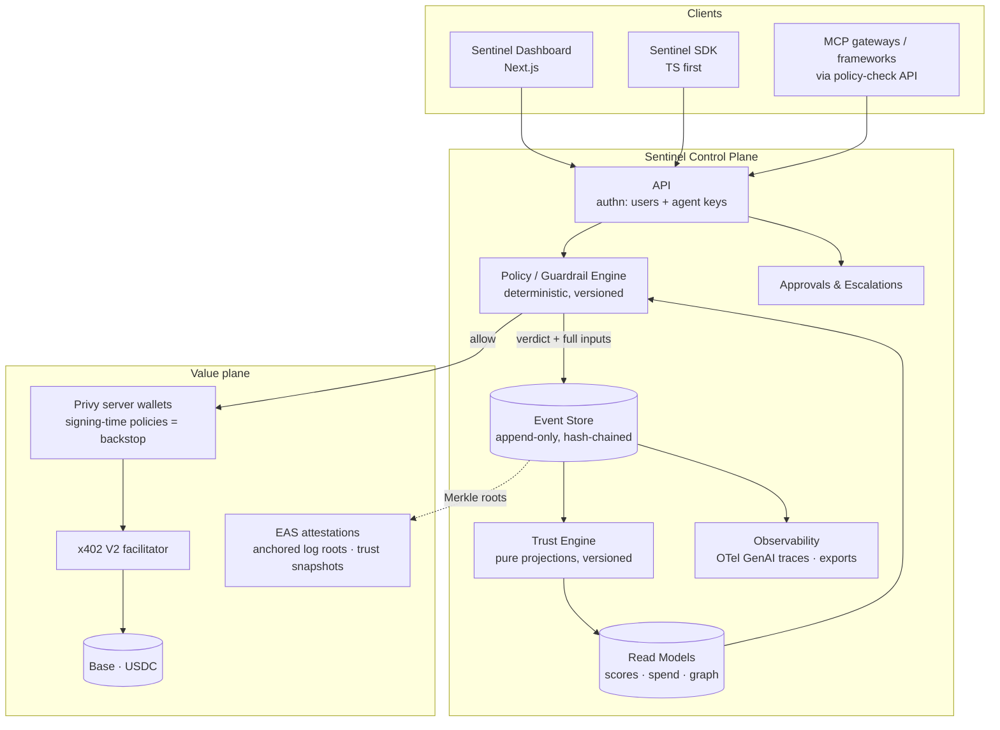

# Architecture

> Two halves: the **current architecture** (what's in this repo, exactly) and the
> **target architecture** (what the production platform becomes). The invariant
> across both: a pure deterministic engine over an append-only event log, with
> everything else derived. Companion docs: `SYSTEM_OVERVIEW.md` (plain-language
> tour), `DATA_FLOW.md` (flows), `KNOWN_LIMITATIONS.md` (gaps).

---

## Part 1 — Current architecture (v1, hackathon MVP)

### Layers

```
app/                 Next.js 16 App Router — pages + API routes (the edges)
  page.tsx               landing
  dashboard/             operations: roster, stats, rankings, chat, x402 demo
  graph/                 organization graph + agent-to-agent delegation
  agents/[id]/           worker profile: trust ring, breakdown, governance, run
  api/agent              streaming tool-calling AI agent (Node runtime)
  api/premium            x402-gated resource (seller side)
  api/x402/buy           server agent wallet auto-pays the gate (buyer side)
  api/verify-payment     on-chain USDC verification
  api/health             liveness + env sanity
middleware.ts        x402 payment gate (before matched routes)

components/          UI
  agents/                the Sentinel workforce UI (roster, graph, trust ring,
                         breakdown, governance, delegation, feeds, rankings)
    agents-provider.tsx  ★ client store — the v1 system of record
  agent/ · payment/ · wallet/ · x402/   feature blocks from the starter
  ui/                    small primitive kit (button, card, badge, dialog…)
  providers.tsx          Privy → QueryClient → wagmi stack, client-only mount
  demo-mode.tsx          wallet-free demo resilience

hooks/               React data layer
  use-agents (store) · use-agent (chat) · use-wallet · use-payment ·
  use-usdc-balance · use-usdc-transfer

lib/                 framework-agnostic core (the brain) — never imports up
  agents/                ★ domain: types · reputation · governance ·
                           authorization · seed · format
  chains · constants · env · viem · usdc · tx · x402 · wagmi · ai/* ·
  brand · utils

scripts/             tsx CLIs (self-contained, no Next imports):
                     wallet-new · check-env · balance · send-usdc
```

Dependency direction: `app → components/hooks → lib`; `lib` never imports up.
The `lib/agents` engine has **no React/server imports** — it is the portable
core that later moves behind a service boundary unchanged.

### The v1 system of record

`agents-provider.tsx` holds `{ agents, events }` in React state persisted to
localStorage (`sentinel.store.v1`). Trust, spend, autonomy, budget advice, and
graph edges are **derived on read** via the pure engine. The provider's surface
(`agents, events, createAgent, recordEvent, payAgent, setStatus, setBudget,
scoreFor, spendFor, projectDelta, reset`) is the deliberate seam for swapping in
an API + database without touching UI or engine.

### Key flows (unchanged from the starter, still accurate)

- **Wallet auth:** `Providers` mounts `PrivyProvider → QueryClientProvider →
  WagmiProvider(@privy-io/wagmi)`, client-side only (Privy can't SSR). Privy
  owns identity + embedded/external wallets; the bridge feeds wagmi hooks.
  No Privy app id ⇒ the whole app runs in **demo mode** instead of crashing.
- **Guardrailed autonomous purchase:** profile → `checkAuthorization()`
  (`lib/agents/authorization.ts`) → blocked ⇒ `limit_blocked` event; clear ⇒
  `POST /api/x402/buy` → server wallet pays 402-gated `/api/premium` via
  `payingFetch` → settlement hash recorded in a `payment_success` event →
  trust delta toast. (Demo mode / failed real payment ⇒ labelled simulation.)
- **x402 seller:** `middleware.ts` runs `paymentMiddleware` on `/api/premium`;
  no `X402_PAY_TO_ADDRESS` ⇒ gate disabled so local dev always works.
- **AI agent:** `/api/agent` streams AI SDK v6 `streamText` with
  `commerceTools`; value-moving tools return **unsigned intents** the user
  signs — the model never holds keys.
- **The one switch:** `NEXT_PUBLIC_CHAIN` (`base-sepolia` | `base`) drives
  `lib/chains.ts`; every module reads chain, USDC address, explorer, RPC, and
  x402 network from it.
- **Env boundary:** `clientEnv` (NEXT_PUBLIC_*, validated at load) vs
  `serverEnv()` (secrets, lazy, throws in browser).

### v1 truth-in-labeling

Enforcement runs client-side; `/api/x402/buy` trusts its caller; state is
single-browser. This inverts the product's core promise and is the first thing
the target architecture fixes — see `KNOWN_LIMITATIONS.md` P0.

---

## Part 2 — Target architecture (the platform)

### Principles (from `context/sentinel.md` + 2026 research)

1. **Enforcement where value moves** — authoritative decision server-side at
   the payment/tool boundary; wallet signing-time policy (Privy) as the
   non-bypassable backstop; UI checks are previews only.
2. **Event sourcing** — append-only, hash-chained event store is the system of
   record; every read model (trust, spend, graphs, dashboards, SOC2 evidence)
   is a replayable projection. Versioned scoring algorithms; deterministic
   replay divergence detection.
3. **Deterministic policy decisions** — a decision is a pure function of
   (policy version, authorization, ledger projection, request); the full input
   set is logged with the verdict. Hand-rolled evaluator first; Cedar when
   policy count grows.
4. **Progressive trust, human escalation** — autonomy tiers gate what needs
   approval; approval requests are first-class objects; a kill switch always
   works.

### Component view



### Enforcement path (the heart)

```mermaid
sequenceDiagram
  participant A as Agent (holds Sentinel agent key)
  participant S as Sentinel API
  participant P as Policy Engine
  participant W as Privy server wallet
  participant F as x402 facilitator

  A->>S: intent: pay $X for <resource> (category, counterparty)
  S->>P: evaluate(authorization, trust tier, ledger, request)
  alt out of scope
    P-->>S: BLOCK + reason
    S->>S: append limit_blocked event
    S-->>A: 403 + explainable reason
  else in scope
    P-->>S: ALLOW + decision trace
    S->>S: append attempt event
    S->>W: sign payment (wallet policy re-checks caps)
    W->>F: settle USDC on Base
    F-->>S: settlement hash
    S->>S: append payment_success event
    S-->>A: 200 + receipt
  end
  Note over S: trust projections update; tier/budget<br/>recommendations recompute from the log
```

Two enforcement layers on purpose: Sentinel's engine gives explainable,
policy-rich decisions and the audit record; the wallet's signing-time policy
guarantees that even a bypassed or buggy control plane cannot move
out-of-policy value.

### Storage & evolution path

| Stage | System of record | Enforcement | Identity |
|---|---|---|---|
| v1 (now) | browser localStorage | client UI | none |
| v1.5 | Postgres via API (same provider seam) | server route pre-flight | session auth (Privy) |
| v2 | append-only event store + hash chain, projections | policy engine at API + Privy wallet policies | orgs, roles, agent keys |
| v3 | + Merkle roots anchored via EAS on Base | + MCP-gateway integration surface | + portable agent attestations (ERC-8004-compatible) |

Each stage is an incremental migration across the seams that already exist
(`agents-provider` surface; pure engine signatures) — no rewrite.

### What Sentinel deliberately does NOT build

- Payment rails (x402/facilitators exist) · wallets/key custody (Privy/CDP) ·
  agent frameworks · MCP gateway plumbing (integrate; don't compete) ·
  opaque ML trust scores (advisory anomaly signals only).
