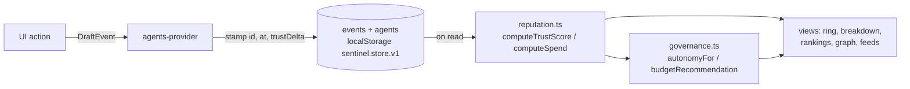
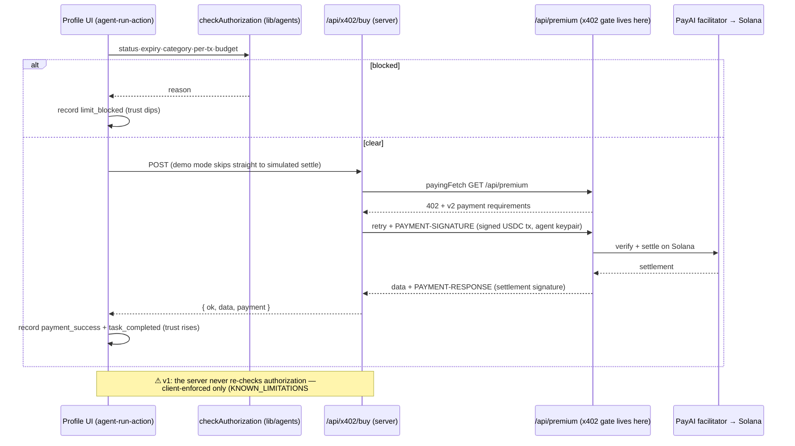

# Data Flow

> How data moves through Sentinel v1, end to end. Structure in
> `ARCHITECTURE.md`; this doc is the mechanics.

## 1. State & derivation (the core loop)

- Writes: `createAgent`, `recordEvent`, `payAgent`, `setStatus`, `setBudget` —
  all funnel through the provider, which persists the whole store on change.
- `recordEvent` stamps `trustDelta` by scoring before/after
  (`projectScoreDelta`) so feeds can explain every movement.
- Reads are pure recomputation over the full log — no cached scores anywhere.

## 2. Guardrailed autonomous purchase (single agent)

Failure at any server step ⇒ the UI records a **labelled simulated**
settlement instead (demo resilience; see CONSTRAINTS #10 for the target rule).

## 3. Agent-to-agent delegation

`agent-commerce.tsx` → `checkDelegation()` (payer status/expiry/tier/category/
per-tx/budget + payee status) → `payAgent(payer, payee, amount, service)` →
two linked events: payer `payment_success` (+`counterpartyId`) and payee
`task_completed`. No on-chain settlement in v1 — simulated coordination. The
`counterpartyId` pair is what `trust-graph.tsx` projects into animated edges
(dedup by payer→payee, count accumulates).

## 4. AI commerce chat

`agent-chat.tsx` (`useChat`) → `POST /api/agent` → AI SDK v6 `streamText`
(OpenAI else Anthropic) with `commerceTools`, up to 5 steps. Read-only tools
(balance, status, quote) execute server-side; `prepareUsdcTransfer` returns
an **unsigned transaction** streamed back as tool parts — the user signs in
their own wallet (Privy, Solana). Chat state is ephemeral (not in the event log).

## 5. User USDC payment + verification

`usdc-payment.tsx` → `usePayment` state machine (validate → sign via
`useUsdcTransfer`/Privy Solana wallet → wait for confirmation) → optional
server-side proof: `POST /api/verify-payment { signature, expectedTo,
minAmount }` → the server reads the parsed transaction over the RPC
connection, diffs pre/post USDC token balances across every account the tx
touched (Solana has no ABI-decoded `Transfer` event log to decode), confirms
amount/recipient. Server verification exists precisely because "the client
said it paid" is never trusted — the one place v1 already follows the target
enforcement philosophy.

## 6. Environment & configuration flow

`NEXT_PUBLIC_SOLANA_CLUSTER` → `lib/solana.ts` → everything (active cluster,
USDC mint, explorer, x402 network, RPC connection, scripts' equivalents).
`clientEnv` validated at module load (browser-safe); `serverEnv()` lazy,
server-only, throws in browser. Missing Privy id ⇒ `providers.tsx` renders the
demo-mode tree (no Privy mounted at all) — the reason the whole app works
with zero configuration.

## 7. Seed & reset

First load (no stored state) ⇒ `buildSeed(Date.now())` constructs Atlas/Nova/
Probe and ~25 back-dated events (relative to now, so feeds look fresh).
`DemoReset` clears and reseeds. Seed never runs at module scope — SSR/client
consistency.

## v2 deltas (when M2 lands)

The provider's write surface becomes API calls; the log becomes an append-only
Postgres table (hash-chained); guardrail evaluation moves inside the server
spend path with verdict+inputs logged; wallet signing moves to Privy server
wallets (Solana) with policy backstop. **No diagram above changes shape —
only custody and placement.** That's the point of the seams.
