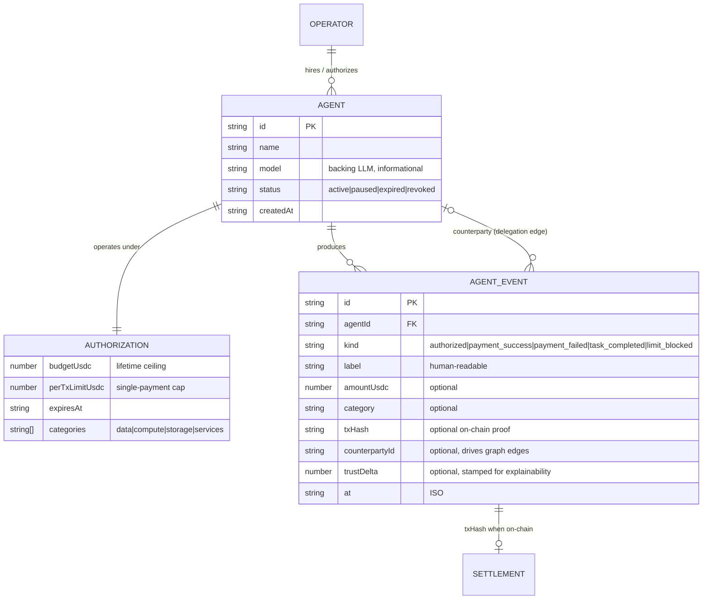

# Domain Model

> The core entities of Sentinel's universe and their relationships. Source types:
> [`src/lib/agents/types.ts`](../src/lib/agents/types.ts). The domain layer is
> deliberately framework-agnostic (no React, no server-only imports) so the same
> model runs in the browser store, API routes, and scripts.

## Entities

### Agent (Worker)
An autonomous AI process the operator has hired. Identity today is an app-local
id; the backing model (`model`) is informational only. Lifecycle `status` is the
operator's kill switch — `paused`/`revoked` overrides every other permission.

### Authorization
The scoped grant of financial authority — the object governance evaluates
against. One active authorization per agent in v1 (updates overwrite; each
change records an `authorized` event for audit).

### AgentEvent (the ledger)
**The central abstraction.** An immutable, append-only record of everything an
agent did or attempted. Everything else — trust, spend, autonomy, budget
recommendations, the org graph, the activity feeds — is a *projection* of this
log. `DraftEvent` (event minus `id`/`at`) is what callers construct; the store
stamps identity, time, and `trustDelta`.

### Derived (never stored) projections
| Projection | From | Function |
|---|---|---|
| `SpendSummary` (spent, remaining, utilization) | `payment_success` amounts vs budget | `computeSpend` |
| `TrustScore` (score, grade, confidence, factors) | full event history | `computeTrustScore` |
| `Autonomy` (tier, canDelegate) | trust score | `autonomyFor` |
| `BudgetRecommendation` | trust + spend | `budgetRecommendation` |
| Organization graph edges | events with `counterpartyId` | UI projection |

## Invariants

1. Events are append-only; nothing ever mutates or deletes an event.
2. No derived value is persisted — recompute on read (cache later if needed, but
   the log stays the source of truth).
3. `payment_success` with `counterpartyId` ⇒ a matching `task_completed` on the
   counterparty (delegation records both sides).
4. Every blocked attempt is recorded — absence of a block event means the
   attempt was never made, not that it was silently dropped.

## Future entities (target architecture, not yet in code)

- **Operator / Organization** — today implicit (single browser). Multi-tenant
  backend introduces real users, orgs, roles.
- **Policy** — generalization of Authorization beyond spend (tools, data,
  actions) with versioning and approval workflow.
- **Attestation** — portable, signed claims about an agent's record (on-chain or
  off) enabling cross-platform reputation.
- **ApprovalRequest** — human-in-the-loop escalation object for actions above an
  agent's autonomy tier.
