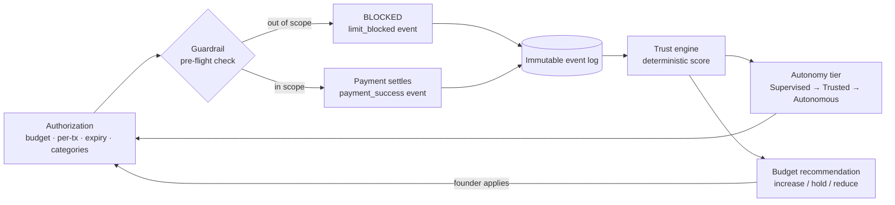

# Governance Model

> How Sentinel converts trust into economic consequence — authorization scopes,
> pre-flight guardrails, autonomy tiers, and capital allocation.
> Implementation: [`src/lib/agents/governance.ts`](../src/lib/agents/governance.ts)
> (tiers, budgets) and the guardrail checks currently in
> [`src/components/agents/agent-run-action.tsx`](../src/components/agents/agent-run-action.tsx).

## The governance loop

Every arrow is auditable: the log records the attempt, the decision, the reason,
and the trust impact.

## 1. Authorization (the scope grant)

A human grants an agent *scoped* financial authority — never a blank key:

| Field | Meaning |
|---|---|
| `budgetUsdc` | Lifetime spend ceiling |
| `perTxLimitUsdc` | Hard cap on any single payment |
| `expiresAt` | Authority ends at this time regardless of behaviour |
| `categories` | Allowed spend categories (`data`, `compute`, `storage`, `services`) |

Plus a lifecycle `status` on the agent: `active | paused | expired | revoked`.

## 2. Guardrails (pre-flight enforcement)

Checked **before any value moves**, in order:

1. Agent status is `active` (pause/revoke wins over everything).
2. Authorization not expired.
3. Requested category ∈ authorized categories.
4. Amount ≤ per-transaction limit.
5. Amount ≤ remaining budget (budget − derived spend).

A failed check emits a `limit_blocked` event with the human-readable reason —
the block itself becomes part of the behavioural record.

> **⚠ Enforcement placement (v1 gap):** today these checks run in the browser
> component that initiates the purchase. The server route that actually spends
> (`/api/x402/buy`) does **not** re-check them — the demo trusts its UI. The
> production rule is: **the guardrail runs server-side at the payment boundary;
> the UI check is a courtesy preview.** This is the top item in
> `docs/KNOWN_LIMITATIONS.md` and the first milestone of the roadmap.

## 3. Autonomy tiers

Trust score gates what an agent may do without a human:

| Tier | Threshold | Rights |
|---|---|---|
| **Supervised** | score < 66 | Operates only within scope; may **not** delegate; high-value actions need human approval |
| **Trusted** | 66–83 | Operates independently within scope; may delegate |
| **Autonomous** | ≥ 84 (AA) | May hire/pay other agents, hold larger budgets |

Principle: **delegation is a privilege of demonstrated reliability.** An
unproven agent cannot propagate authority to other agents — this bounds the
blast radius of a misbehaving newcomer.

## 4. Capital allocation

`budgetRecommendation(agent, trust, spend)` produces an explainable suggestion:

- **score ≥ 80** → recommend `increase` (×1.5), stronger rationale if utilization ≥ 60%
- **score < 55** → recommend `reduce` (×0.5)
- otherwise → `hold`

The founder applies recommendations explicitly (one click) — Sentinel v1 never
auto-adjusts budgets. Progressive autonomy (auto-apply within bounds for
Autonomous-tier agents) is a deliberate *future* step that must itself be
governed by policy.

## 5. Delegation (agent-to-agent)

A trusted agent may hire another agent: the payer records a `payment_success`
with `counterpartyId`, the payee records a `task_completed` — both reputations
evolve, and the pair forms an edge in the organization graph. In v1 the
delegated payment is simulated coordination (`payAgent` in the store); real
delegated x402 settlement between distinct agent wallets is future work.

## Governance principles (constraints on v2+)

1. Governance decisions must be **deterministic and reproducible** — a given
   (authorization, ledger, request) triple always yields the same allow/block
   and the same recorded reason.
2. **Deny by default.** Anything outside an explicit grant is blocked.
3. **Blocks are first-class data.** They feed trust, audit, and anomaly review.
4. **Humans stay in the escalation path.** Autonomy tiers change what needs
   approval, never whether an approval path exists.
5. **Policy will outgrow spend.** The v2 policy engine generalizes guardrails to
   tools, data access, and actions (PBAC), keeping the same
   check-log-score-gate loop. See `docs/ROADMAP.md`.
