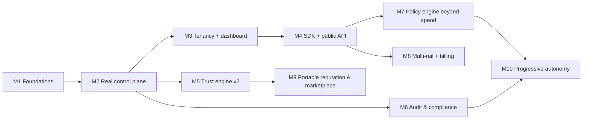

# Roadmap

> Milestones from hackathon MVP to governance platform. Each milestone says
> **why it exists**, **what depends on it**, and **its main risk**. Sequencing
> follows one rule: *never widen the surface before the enforcement and audit
> story underneath it is honest.* Dates deliberately omitted until staffing is
> known; order matters more than calendar.

## M1 — Foundations (repo trustworthy) ✅ largely done 2026-07-03
**Why:** you cannot refactor toward production on an untested, undocumented
base. **Contents:** context/docs system; shared `checkAuthorization()` in
`lib/agents` (single guardrail implementation, payer+payee checks); vitest +
engine test suite; dead-code removal; CI (typecheck+lint+test on push — still
open); decide on simulation-as-explicit-mode (not silent fallback).
**Depends on:** nothing. **Risk:** none — pure hygiene.

## M2 — Real control plane (the honest MVP)
**Why:** the product promise ("checked before value moves") is currently
inverted — client-enforced, server pays blindly. This milestone is existential.
**Contents:** Postgres append-only event store + agents/authorizations tables
(hash-chain events from day one); API routes for the `agents-provider` surface
(the seam was built for this); guardrail evaluated **server-side** in
`/api/x402/buy` (and every future spend path), verdict + full inputs logged;
replace raw `AGENT_PRIVATE_KEY` with **Privy server wallets (Solana) +
signing-time policies** (hard backstop); auth + rate limiting on all value
routes. (The x402 V1→V2 migration originally scoped here is done — the repo
already runs on `x402-solana`, protocol v2, as of the Solana port.)
**Depends on:** M1 (tests protect the engine through the move).
**Risk:** Privy server-wallet API differences on Solana — spike first. This is
the largest single step; split into store→enforcement→wallet if needed.

## M3 — Tenancy + operator dashboard
**Why:** first external users need orgs, roles, and a real login — and the
demo UI already *is* the dashboard, it just needs real data.
**Contents:** organizations, members, roles (owner/admin/viewer); Privy auth
for humans; per-org agents/events; the existing dashboard/graph/profile pages
reading from the API; demo mode preserved as an explicit sandbox tenant.
**Depends on:** M2. **Risk:** scope creep — resist enterprise RBAC depth here.

## M4 — SDK + public API (the actual product surface)
**Why:** customers integrate agents we don't host; the dashboard is the
control room, but the SDK is the product. Also unlocks design-partner revenue.
**Contents:** TS SDK (`sentinel.check()`, `sentinel.record()`, wrapped
`payingFetch`); agent API keys; OpenAPI spec; quickstarts for AI SDK /
LangGraph / MCP-tool wrapping; per-decision metering (billing substrate).
**Depends on:** M3. **Risk:** API design lock-in — version from v0, expect
breakage until two design partners run in prod.

## M5 — Trust engine v2
**Why:** v1 is honest but gameable (no decay, no amount weighting,
self-reported tasks); scores that gate real money must resist adversaries.
**Contents:** versioned scoring algorithms with replay determinism checks
(ESAA-style projection hashes); exponential time decay; amount-weighted
reliability; payment-backed > self-reported evidence weighting; counterparty
diversity; per-factor attribution preserved (non-negotiable); score history API.
**Depends on:** M2's durable event store (needs volume to calibrate).
**Risk:** over-engineering before data — calibrate against real tenant logs,
not intuition.

## M6 — Audit & compliance surface
**Why:** the buyer's compliance team is the economic buyer's veto; SOC2-grade
evidence is also our stickiness (system-of-record gravity). Research: auditors
now flag unattributed privileged agent actions.
**Contents:** tamper-evident log verification (hash-chain check endpoint,
Merkle batching, anchored roots on-chain — Solana has no direct EAS
equivalent, so the anchoring mechanism itself is an open research question for
this milestone, not a settled choice); decision "why-trail" exports
(inputs + policy version + verdict); OTel GenAI-conformant tracing; PII
redaction before write; kill-switch and human-override attestation; Sentinel's
own SOC2 Type I track.
**Depends on:** M2. **Risk:** anchoring cadence vs cost — batch, don't
per-event.

## M7 — Policy engine beyond spend
**Why:** spend is the wedge; authority is the market. Same loop
(check→log→score→gate) generalized to tools, data, actions — PBAC.
**Contents:** policy objects (versioned, approvable); deterministic evaluator
with full evaluation-trace logging (adopt Cedar when policy count demands);
MCP tool-call checking via gateway integrations (plug into ContextForge-class
gateways — do not build a gateway); approval-request objects
(human-in-the-loop, maps to MCP elicitation).
**Depends on:** M4 (surface), M3 (roles for approvers).
**Risk:** becoming a generic authz vendor — every policy feature must keep the
trust/autonomy loop attached, or Permit.io/Cedar commoditize us.

## M8 — Multi-rail + billing
**Why:** x402 is the beachhead, not the bet — Solana already carries roughly
65% of all x402 volume, but AP2 mandates and virtual cards are still needed to
reach fiat enterprises. Also: charge money.
**Contents:** rail adapters (x402-solana, AP2 mandate verification,
virtual-card issuing partner); rail-neutral ledger schema (already true — keep it);
Stripe billing on per-agent + per-decision metering from M4.
**Depends on:** M4. **Risk:** each rail is a partnership + compliance surface;
sequence by customer demand, not completeness.

## M9 — Portable reputation & marketplace surface
**Why:** the long-term moat is the behavioral corpus; portability
(attestations) makes Sentinel scores an ecosystem primitive rather than a silo.
**Contents:** signed trust-snapshot attestations (anchoring mechanism TBD —
Solana has no direct EAS equivalent; open research question, see M6);
portable identity mapping compatible with emerging agent-identity standards;
score-sharing consent model;
trust-aware discovery API ("hire the most reliable provider").
**Depends on:** M5 (scores worth porting), M6 (integrity story).
**Risk:** Sybil/gaming goes adversarial the moment scores are public —
evidence-weighting (settled USDC > self-report) must already be in place.

## M10 — Progressive autonomy (the endgame feature)
**Why:** the original thesis — autonomy that *earns itself*: auto-apply budget
increases within operator-set bounds, auto-approve low-risk actions for
Autonomous-tier agents, escalate outliers to humans.
**Contents:** autonomy policies (operator-defined envelopes); anomaly
advisories (ML flags, deterministic decisions); staged rollout tooling;
insurance-partner hooks (AIUC-style underwriting off our log).
**Depends on:** M6 + M7 (never automate what you can't audit and override).
**Risk:** one bad auto-decision is a company-ending story — ship behind
per-tenant opt-in, tight envelopes, and a public kill switch, in that order.

---

### Deliberately not on the roadmap
Agent framework · payment rail · wallet custody · MCP gateway · seller-side
billing · opaque ML scores of record. See `VISION.md` "what we refuse to build."

### Standing constraints on all milestones
Every feature preserves: deterministic replayable decisions · per-factor
explainability · append-only log integrity · human kill switch · demo mode as
an explicit sandbox (never a silent fallback).
